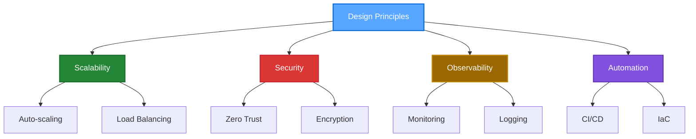

# 🌌 Bintang Caesar

<div align="center">
  
  **`Cloud Systems Architect • Indonesia`**
  
  ```ascii
  ╔═══════════════════════════════════════════════════════════════╗
  ║  █▀▀ █   █▀█ █   █ █▀▄   █▀▀ █ █ █▀▀ ▀█▀ █▀▀ █▄█ █▀▀        ║
  ║  █▄▄ █▄▄ █▄█ █▄█ █▄▀   ▄▄█ █▄█ ▄▄█  █  ██▄ █ █ ▄▄█        ║
  ║                                                               ║
  ║           > Designing Tomorrow's Infrastructure Today         ║
  ╚═══════════════════════════════════════════════════════════════╝
  ```
  
  [](https://git.io/typing-svg)

</div>

---

## 🚀 **Mission Statement**

> *"Architecting cloud infrastructure that transcends conventional boundaries—where scalability meets security, and innovation drives transformation."*

**Currently focused on:**
- 🌐 **Cloud-Native Ecosystems** → Microservices, containerization, and orchestration
- 🔄 **Infrastructure as Code** → Terraform, Ansible, and automated deployments  
- 📊 **Observability & Monitoring** → Real-time insights and performance optimization
- 🛡️ **Zero-Trust Security** → Multi-layered protection and compliance frameworks

---

## 💼 **Professional Identity**

```yaml
role: Cloud Systems Architect & Developer
location: Indonesia 🇮🇩
company: NexusNode (Founder)
mission: Scalable • Secure • Open Infrastructure
contact: bintang.caesar71@smk.belajar.id
```

<div align="center">
  
  **🏢 NexusNode** - *Cloud Service Brand*
  
  *Empowering businesses with fault-tolerant, cloud-native solutions*
  
</div>

---

## ⚡ **Technology Arsenal**

<div align="center">

### **Cloud Platforms & Infrastructure**


### **DevOps & Automation**


### **Databases & Storage**


</div>

---

## 📈 **Code Analytics**

<div align="center">
  
  
  
  

</div>

---

## 🌟 **System Architecture Philosophy**



---

## 🎯 **Current Focus Areas**

<div align="center">

| 🔧 **Infrastructure** | 📊 **Monitoring** | 🛡️ **Security** | 🚀 **Innovation** |
|:---:|:---:|:---:|:---:|
| Kubernetes Orchestration | Prometheus & Grafana | Zero-Trust Architecture | Edge Computing |
| Terraform Automation | Distributed Tracing | Identity Management | Serverless Functions |
| Multi-Cloud Strategy | Performance Optimization | Compliance Frameworks | AI/ML Integration |

</div>

---

## 🌐 **Digital Presence**

<div align="center">
  
  [](https://linkedin.com/in/BintangXD112)
  [](https://github.com/BintangXD112)
  [](mailto:bintangxd.caesar71@smk.belajar.id)
  
  ---
  
  **"In the realm of cloud architecture, we don't just build systems—we craft digital ecosystems that evolve, adapt, and thrive in the ever-changing technological landscape."**
  
  <sub>⚡ Powered by innovation • Secured by design • Scaled for tomorrow</sub>

</div>

---

<div align="center">
  
  ```
  ╭─────────────────────────────────────────────────────────────────╮
  │                     Thank you for visiting!                     │
  │                                                                 │
  │     Feel free to explore my repositories and connect with me    │
  │          Let's build the future of cloud infrastructure         │
  ╰─────────────────────────────────────────────────────────────────╯
  ```
  
</div>
